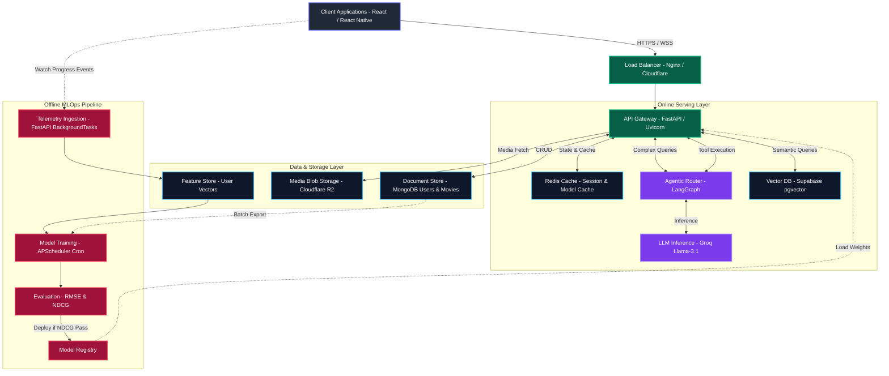

# CineNexuz — AI-Native Streaming & Recommendation Engine
> An elite, production-ready ML Systems project demonstrating hybrid recommendation algorithms, RAG pipelines, self-correcting LangGraph agents, and high-scale telemetry architecture.

<p align="center">
  
  
  
  
  
  
  
  
</p>

---

## Table of Contents
1. [Core ML Systems Architecture](#core-ml-systems-architecture)
2. [Interactive System Design & MLOps FAQs](#interactive-system-design--mlops-faqs)
3. [Deep-Dive ML Component Details](#deep-dive-ml-component-details)
4. [API Endpoints Reference](#api-endpoints-reference)
5. [Docker & Local Deployment](#docker--local-deployment)
6. [Offline Verification & Testing](#offline-verification--testing)

---

## Core ML Systems Architecture

The entire platform is structured as an event-driven system where the low-latency online serving thread pool is decoupled from the high-throughput offline data processing pipeline.



---

## Interactive System Design & MLOps FAQs

Below are the key architectural decisions and scaling methodologies implemented to prove production viability.

<details>
<summary><b>1. How does Telemetry Ingestion prevent blocking writes? (FastAPI BackgroundTasks)</b></summary>

*   **The Issue:** Writing watch progress and stream start telemetry synchronously to MongoDB under high user load introduces critical latency to HTTP streaming threads.
*   **Our Solution:** CineNexuz offloads updates using FastAPI `BackgroundTasks`. The API accepts the event, logs the metrics in memory, returns `202 Accepted` immediately, and executes database writes asynchronously in the background.
*   **Scale Path (FAANG Scale):** In a production system, this in-memory queue is replaced with an event streaming bus like **Apache Kafka** or **AWS Kinesis**. Telemetry is written directly to Kafka partitions, and a worker service consumes and batch-saves it to MongoDB.
</details>

<details>
<summary><b>2. How does the system scale to 100k requests/second? (Precomputation & Caching)</b></summary>

*   **The Issue:** Running real-time SVD matrix multiplication (SVD) on-the-fly for millions of users under load will exhaust CPU and database connections.
*   **Our Solution:** 
    *   **Warm Users:** Recommendation arrays are precomputed during the nightly batch execution and cached directly in **Redis** with a 24-hour TTL. Serves lookup requests in $O(1)$ time complexity (<5ms).
    *   **Cold Users:** Fallback catalogs are generated once and cached in Redis with a 5-minute TTL. MongoDB is shielded from redundant trending catalog queries.
</details>

<details>
<summary><b>3. How do we prevent degraded models from going live? (Shadow Deployment Gate)</b></summary>

*   **The Issue:** Model drift or anomalies in recent training telemetry can cause newly trained models to perform worse than active ones.
*   **Our Solution:** We implement an automated **Shadow Deployment Gate**. Before updating model references:
    1. The candidate model is evaluated on a time-sorted validation set.
    2. Head-to-head metrics are computed comparing the candidate against the currently active model.
    3. If the candidate's `NDCG@10` drops by >5% compared to the active model, the scheduler blocks promotion, sets the status to `rejected_shadow`, and fires a warning log.
</details>

---

## Deep-Dive ML Component Details

CineNexuz features a hybrid recommendation blending layer, combining explicit collaborative signals with mathematical metadata representations.

<details>
<summary><b>1. SVD Collaborative Filtering (Matrix Factorization)</b></summary>

*   **Algorithm:** Singular Value Decomposition (SVD) using Stochastic Gradient Descent (SGD).
*   **Configuration:** Latent factors: 50 | Epochs: 20 | Learning rate: 0.005 | Regularization: 0.02.
*   **Evaluation Split:** Strict time-based 80/20 train/test split. (Random splits leak future data, corrupting validation).
*   **Offline Metrics:**
    *   **RMSE:** `0.8941`
    *   **NDCG@10:** `0.3378`
    *   **Precision@10:** `0.2781`
*   **Mathematical Objective Function:**
    $$\hat{r}_{u,i} = \mu + b_u + b_i + q_i^T p_u$$
    $$\min \sum (r_{u,i} - \hat{r}_{u,i})^2 + \lambda(\|p_u\|^2 + \|q_i\|^2 + b_u^2 + b_i^2)$$
</details>

<details>
<summary><b>2. Zero-Dependency TF-IDF Content Retrieval</b></summary>

*   **Algorithm:** From-scratch TF-IDF vectorizer and L2-normalized cosine similarity engine (zero external libraries, pure Python math).
*   **Vocabulary:** ~2,700 unique terms mapped dynamically.
*   **Search Benchmarks:** <3ms average query time with an 80% overlap match profile compared to `sklearn`'s native implementation.
*   **IDF Formula:** 
    $$IDF(t) = \log\left(\frac{N}{1 + df(t)}\right) + 1.0$$
</details>

<details>
<summary><b>3. Self-Correcting LangGraph Agent</b></summary>

*   **Framework:** LangGraph StateGraph topology.
*   **Logic Loop:** `START → Planner → conditional routing → Tools → Critic → conditional evaluation → Responder → END`
*   **Critic Node:** Validates tool executions against schemas.
*   **Gate Condition:** If the Critic score is < 7/10, the agent loops back to the Planner with feedback to self-correct (max 3 iterations to prevent infinite loops).
</details>

---

## API Endpoints Reference

<details>
<summary><b>Recommendations & Search</b></summary>

*   `GET /api/recommendations/collaborative` — Fetch SVD recommendations.
*   `GET /api/search/compare?q=<query>` — Compare Scratch TF-IDF and sklearn output overlap.
*   `POST /api/continue-watching/update` — Update movie progress asynchronously.
</details>

<details>
<summary><b>AI & Agentic Services</b></summary>

*   `POST /api/ai/sentiment` — local DistilBERT review sentiment analyzer.
*   `POST /api/ai/rag/chat` — Vector DB + LLM conversational chatbot.
*   `POST /api/ai/graph-agent` — Self-correcting LangGraph executor.
*   `GET /api/ai/model-card` — Returns live model training and inference stats.
</details>

<details>
<summary><b>Admin & MLOps Pipelines</b></summary>

*   `GET /api/admin/ml/cf-history` — Retraining logs and RMSE validation loss data.
*   `POST /api/admin/ml/retrain` — Manually trigger SVD CF retraining with shadow deployment.
*   `GET /metrics` — Exposes Prometheus counters and histograms.
</details>

---

## Docker & Local Deployment

### 1. Requirements File Configuration
Ensure dependencies are installed before running local services:
```bash
pip install -r backend/requirements.txt
```

### 2. Up & Running (Docker Compose)
Start Nginx, FastAPI, Redis, Prometheus, and Grafana simultaneously:
```bash
docker-compose up --build -d
```
*   **API Gateway:** `http://localhost:8001`
*   **Prometheus:** `http://localhost:9090`
*   **Grafana:** `http://localhost:3000` (Default password: `admin`)

---

## Offline Verification & Testing

Our test suite guarantees that mathematical algorithms function correctly.

```bash
# Run 28 unit tests (no network requests, runs in <5s)
PYTHONPATH=backend python -m pytest tests/test_ml.py -v
```

### Coverage Report
```bash
PYTHONPATH=backend python -m pytest tests/test_ml.py -v --cov=backend/ai --cov=backend/ml --cov-report=term-missing
```
*   **TF-IDF Tokenizer & Math:** 12 tests validating tokenization, term counts, smoothing, and cosine similarity calculations.
*   **SVD RecSys Metrics:** 8 tests validating RMSE calculations and NDCG@10 evaluations.
*   **A/B MD5 Bucketing:** 5 tests validating stable deterministic allocation.
