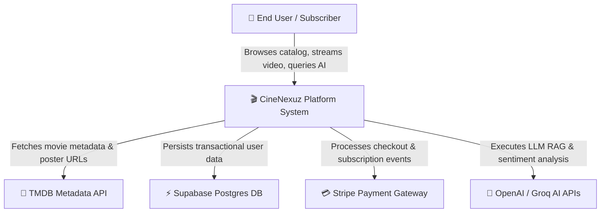
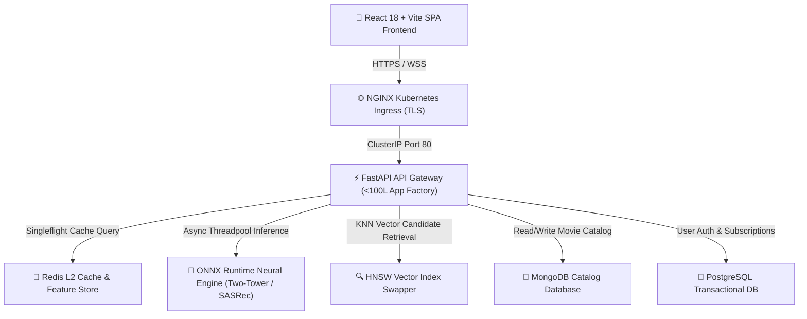
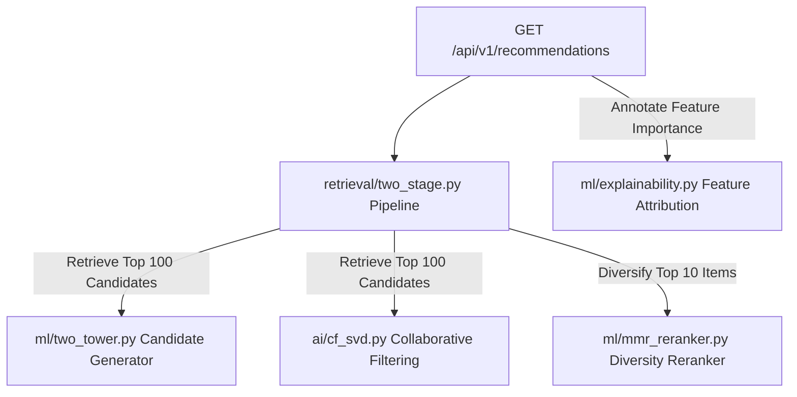

# C4 Model Architecture Specification for CineNexuz

This document outlines the software architecture of **CineNexuz** using the **C4 Model** (Context, Containers, Components, Code) rendered via standard Mermaid.js.

---

## 🌐 Level 1: System Context Diagram

The System Context diagram shows the high-level actors and external systems interacting with CineNexuz.

---

## 📦 Level 2: Container Architecture Diagram

The Container diagram illustrates the high-level technical choices and data flow between client applications, API gateways, caches, and microservices.

---

## 🧩 Level 3: Component Architecture Diagram

The Component diagram breaks down the internal architecture of the `Recommendations APIRouter` and Multi-Stage ML Pipeline.

